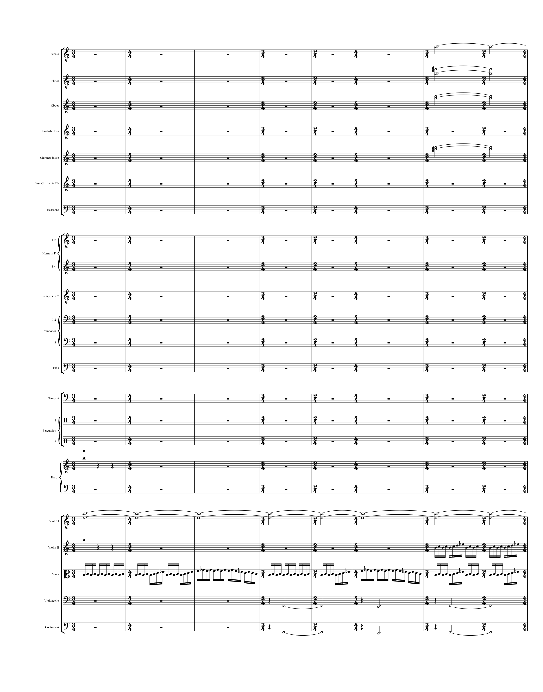

# Opus

Opus is a MusicXML engraving engine written in Rust. It parses MusicXML,
lays the music out into pages, and renders the result to SVG, PDF, or a
canvas via WebAssembly in the browser.



*First page of [ActorPreludeSample.musicxml](assets/xmlsamples/ActorPreludeSample.musicxml),
rendered with `opus render pdf`. This is a static snapshot, not regenerated
automatically, so it can lag behind the current renderer.*

## Status

Opus is a work in progress. Large parts of the engraving pipeline (beaming
across measures and systems, several layout details, and more) are
incomplete or known to be wrong in specific cases. See [ROADMAP.md](ROADMAP.md)
for what is known, planned, or intentionally left unfinished. Nothing here
should be taken as a promise of future behavior.

## Why this exists

Score rendering today tends to be scattered: a web renderer, a desktop app,
a PDF exporter, and a mobile app usually end up as separate codebases with
separate engraving logic, each with its own bugs and its own ceiling on
quality. The point of Opus is a single engraving pipeline, written once in
Rust, that every platform — web, desktop, PDF, mobile, and whatever comes
after — draws from, so that improving the engraving benefits all of them at
once instead of one at a time.

Built on top of that shared pipeline, the longer-term goal is engraved output
that the reader can reshape without touching the underlying music. The same
score should be able to render with a larger font for someone with limited
vision, or a softer, lower-contrast color palette for someone sensitive to
glare, and so on — as user-level presentation settings layered on one
accurate rendering, not a fixed image. That is a deliberate departure from
PDF-style score libraries, where the page is baked once and the reader has
no way to adapt it to their own needs.

## Contributing

This project is not accepting external contributions at the moment. Issues
— bug reports, malformed-output reports, questions about behavior — are
welcome.

## Repository layout

| Path | Contents |
| --- | --- |
| [lib/](lib) | Core crate: MusicXML parsing, validation, layout/engraving, and drawing primitives. |
| [cli/](cli) | `opus`, a command-line binary for rendering and validating MusicXML files. |
| [wasm/](wasm) | WebAssembly bindings over `lib`, built with `wasm-bindgen`. |
| [ffi/](ffi) | C-compatible bindings over `lib`, for native platform targets. |
| [tests/](tests) | Workspace-wide integration and unit tests, kept out of the library crates. |
| [web/](web) | `music-xml.js`, a self-contained web component that renders a MusicXML document to a canvas using the `wasm` crate. |
| [assets/](assets) | SMuFL font metadata, MusicXML sample and fixture files used by the tests, and scratch render output. |
| [platforms/](platforms) | Reserved boundaries for native desktop, iOS, and Android apps. None are started yet; see the README in each. |
| [packaging/](packaging) | npm package manifest for the `web`/`wasm` component. |
| [site/](site) | Source of the exhibition site deployed to [opus.lavalse.net](https://opus.lavalse.net). |
| [scripts/](scripts) | Build and packaging scripts (`build-wasm.sh`, `stage-package.sh`, `build-site.sh`). |

## Building

Opus is a Cargo workspace. All library and CLI crates use the 2024 edition,
which requires Rust 1.85 or newer.

```sh
git clone https://github.com/Studio-La-Valse/Opus.git
cd Opus
cargo build --workspace
cargo test --workspace --all-targets
```

## Using the CLI

The `opus` binary is built from [cli/](cli). It has two subcommands,
`render` and `validate`. Both need a MusicXML file; `render` additionally
needs SMuFL font metadata to resolve glyphs, which the repository ships for
the Bravura font under [assets/smufl/](assets/smufl).

```sh
# Render a MusicXML file to SVG (one file per page)
cargo run -p cli -- render svg \
  --file path/to/score.musicxml \
  --meta assets/smufl/bravura-bravura-1.392/redist/bravura_metadata.json \
  --glyphs assets/smufl/metadata/glyphnames.json \
  --out path/to/output/dir

# Render to a single multi-page PDF instead
cargo run -p cli -- render pdf \
  --file path/to/score.musicxml \
  --meta assets/smufl/bravura-bravura-1.392/redist/bravura_metadata.json \
  --glyphs assets/smufl/metadata/glyphnames.json \
  --out path/to/output/dir

# Parse a MusicXML file and report validation issues without rendering
cargo run -p cli -- validate --file path/to/score.musicxml
```

`render` accepts a large number of additional options controlling colors,
spacing, group symbols, fonts and other layout parameters. They can be kept in
an optional TOML file passed with `--layout`;
[assets/layouts/defaults.toml](assets/layouts/defaults.toml) lists every option
at its default. Each option also has a flag of its own, spelled after its place
in the file (`[tie] height_max` is `--tie-height-max`), which overrides the
file. Run `cargo run -p cli -- render svg --help` for the full list.

Each option is resolved on its own, from the first of these that sets it:

1. its command-line flag;
2. the `--layout` file;
3. the MusicXML document itself, for the few options it can declare — the
   `<appearance>` line widths and note sizes, and each `<part-group>`'s
   `<group-symbol>`;
4. the SMuFL font's `engravingDefaults`, for the line thicknesses it defines —
   staff lines, barlines, beams, stems, ties and group brackets;
5. the app's built-in default, which always has a value. For the thicknesses
   above it is Bravura's own, so it only matters for a font that leaves a value
   out.

Everything above the built-in default is optional: `render` needs neither a
layout file nor any layout flags. Because a layout file outranks the document,
setting an option there replaces what the score declares — passing
`defaults.toml` unchanged resets every line width and note size to the app's.

## Using the web component

The browser-facing piece is a `<music-xml>` custom element in
[web/music-xml.js](web/music-xml.js), backed by the `wasm` crate. Building it
requires the `wasm32-unknown-unknown` target and
[wasm-pack](https://rustwasm.github.io/wasm-pack/installer/):

```sh
rustup target add wasm32-unknown-unknown
./scripts/build-wasm.sh
```

This produces `wasm/pkg/`. From a page that keeps `web/`, `wasm/pkg/`, and
`assets/smufl/` in their relative positions to each other:

```html
<script type="module" src="/path/to/web/music-xml.js"></script>
<music-xml file="score.musicxml"></music-xml>
```

[opus.lavalse.net/render/](https://opus.lavalse.net/render/) exercises every
option the component exposes against the current sample set; see [site/](site).

## License

MIT. See [LICENSE](LICENSE).
